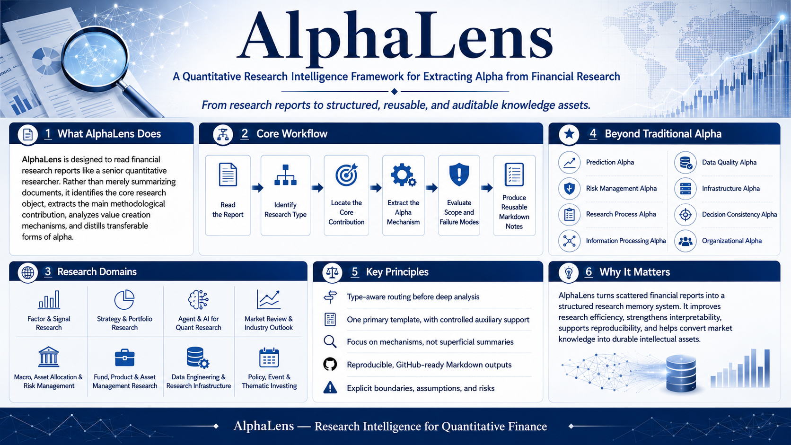

# AlphaLens: A Lightweight Skill-based Framework for Quantitative Research Analysis



[中文版 README](README_CN.md) \| English

## Overview

**AlphaLens** is a lightweight Skill-based framework designed to analyze
quantitative research reports from the perspective of a senior
quantitative researcher.

Instead of simply summarizing research documents, AlphaLens encodes the
methodology of experienced researchers into a reusable analytical
workflow:

-   Identify the research object and category;
-   Select an appropriate analysis template;
-   Locate the core methodological contribution;
-   Extract the underlying Alpha mechanism;
-   Evaluate assumptions, limitations, and failure conditions;
-   Convert research insights into structured and reusable knowledge
    assets.

AlphaLens aims to transform financial research from fragmented documents
into interpretable, auditable, and transferable research knowledge.


## Research Philosophy

A conventional summary asks:

> What does the report say?

AlphaLens asks:

> Why does this research create value?

The framework focuses on different forms of Alpha:

  -----------------------------------------------------------------------
  Alpha Type                          Description
  ----------------------------------- -----------------------------------
  Prediction Alpha                    Improving predictive ability of financial outcomes

  Risk Management Alpha               Improving robustness and downside control

  Research Process Alpha              Improving research efficiency and iteration capability

  Information Processing Alpha        Extracting valuable signals from complex information

  Data Quality Alpha                  Improving research reliability through better data construction

  Infrastructure Alpha                Enhancing scalability and reproducibility of research systems

  Decision Consistency Alpha          Reducing subjective research bias

  Organizational Alpha                Accumulating and transferring  research knowledge
  -----------------------------------------------------------------------

## Core Workflow

    Research Report
            ↓
    Research Type Identification
            ↓
    Template Selection
            ↓
    Core Contribution Analysis
            ↓
    Alpha Mechanism Extraction
            ↓
    Boundary and Failure Analysis
            ↓
    Reusable Research Knowledge
    
## Key Principles

### 1. Skill-based Research Routing

Different research problems require different analytical frameworks.

AlphaLens first identifies:

    Research Object
            ↓
    Research Category
            ↓
    Analysis Template
            ↓
    Value Creation Mechanism

### 2. One Primary Research Template

Each report follows:

-   One primary research template;
-   At most one auxiliary template.

This prevents analysis drift and preserves research focus.

### 3. Mechanism over Description

AlphaLens emphasizes:

-   Information source;
-   Economic mechanism;
-   Market inefficiency;
-   Implementation boundary;
-   Failure conditions.

It focuses on understanding why a method works rather than only
reporting empirical results.

### 4. Reproducible Knowledge Engineering

Outputs are designed for:

-   Markdown-based documentation;
-   Research traceability;
-   Mathematical clarity;
-   Long-term knowledge accumulation.

------------------------------------------------------------------------

## Repository

This repository contains the AlphaLens framework definition and Skill
specification. Research notes generated using AlphaLens are maintained [here](https://github.com/runqi-allen-wang/Quant-Research-Report-Notes).


## Project Structure
```
    AlphaLens/

    ├── README.md
    ├── README_CN.md
    ├── SKILL.md
    └── assets/
        └── alphalens_poster.png
```

## Citation

    AlphaLens: A Lightweight Skill-based Framework for Quantitative Research Analysis.


## License

MIT License.
