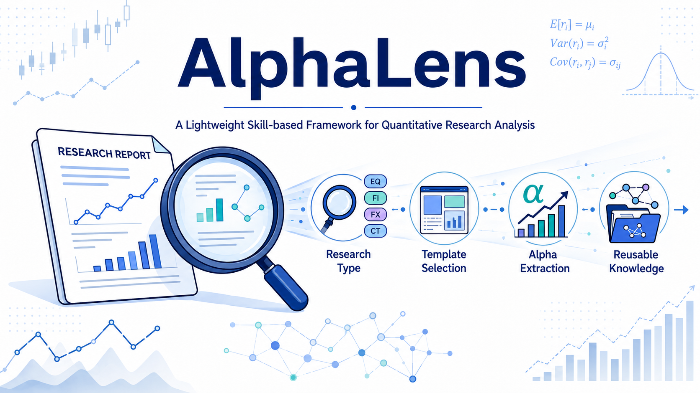
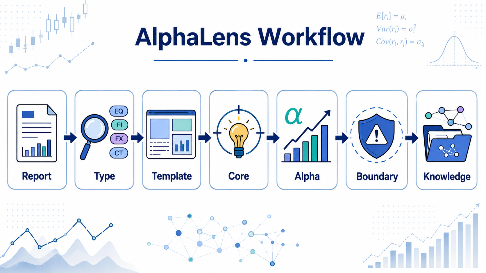

# AlphaLens：一个轻量级的基于技能的量化研究分析框架



中文版 | [English README](README.md)

## 概述

**AlphaLens** 是一个轻量级的基于技能（Skill-based）的框架，旨在从资深量化研究员的视角分析量化研究报告。

不同于简单地对研究文档进行摘要，AlphaLens 将资深研究员的成熟方法论编码为可复用的分析工作流：

- 识别研究对象和研究类别；
- 选择适当的分析模板；
- 定位核心方法论贡献；
- 提取潜在的 Alpha 机制；
- 评估假设条件、局限性和失效场景；
- 将研究洞察转化为结构化、可复用的知识资产。

AlphaLens 的目标是将金融研究从零散的文档转化为可解释、可审计、可迁移的研究知识。

## 研究理念

传统摘要会问：

> 报告说了什么？

AlphaLens 则会问：

> 这项研究为何创造价值？

该框架聚焦于不同形式的 Alpha：

| Alpha 类型 | 描述 |
|-----------|------|
| 预测型 Alpha | 提高金融结果的预测能力 |
| 风险管理型 Alpha | 提高稳健性和下行风险控制能力 |
| 研究流程型 Alpha | 提高研究效率和迭代能力 |
| 信息处理型 Alpha | 从复杂信息中提取有价值的信号 |
| 数据质量型 Alpha | 通过更优的数据构建提升研究可靠性 |
| 基础设施型 Alpha | 增强研究系统的可扩展性和可重复性 |
| 决策一致性型 Alpha | 减少主观研究偏差 |
| 组织型 Alpha | 积累和传递研究知识 |

## 核心工作流


## 关键原则

### 1. 基于技能的研究路由

不同的研究问题需要不同的分析框架。

AlphaLens 首先识别：

    研究对象
        ↓
    研究类别
        ↓
    分析模板
        ↓
    价值创造机制

### 2. 一个主研究模板

每份报告遵循：

- 一个主研究模板；
- 至多一个辅助模板。

这可以防止分析偏离主题，保持研究焦点。

### 3. 机制重于描述

AlphaLens 强调：

- 信息来源；
- 经济机理；
- 市场非有效性；
- 实施边界；
- 失效条件。

它专注于理解方法为何有效，而不仅仅是报告实证结果。

### 4. 可复现的知识工程

输出设计用于：

- 基于 Markdown 的文档；
- 研究可追溯性；
- 数学清晰性；
- 长期知识积累。

---

## 仓库

本仓库包含 AlphaLens 框架定义和技能规范。使用 AlphaLens 生成的研究笔记维护在 [这里](https://github.com/runqi-allen-wang/Quant-Research-Report-Notes)。

## 项目结构

```
AlphaLens/

├── README.md
├── README_CN.md
├── SKILL.md
└── assets/
    └── alphalens_poster.png
```

## 引用

AlphaLens: A Lightweight Skill-based Framework for Quantitative Research Analysis.

## 许可证

MIT 许可证。
